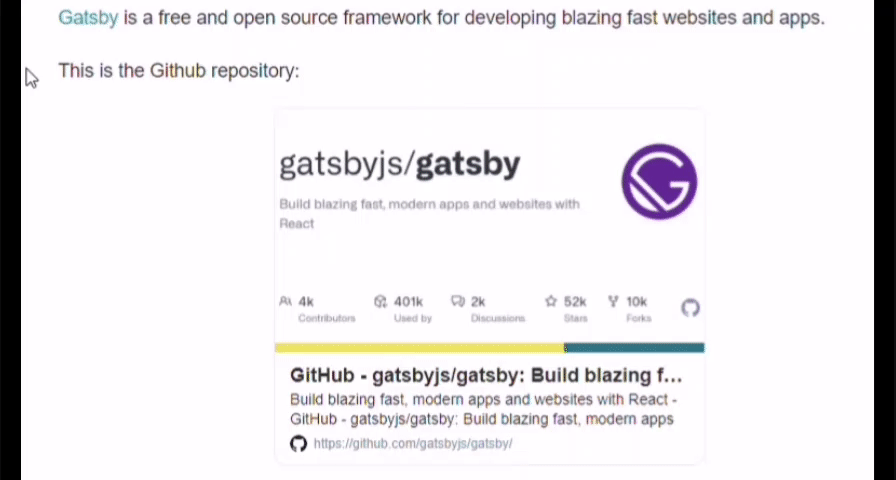

# gatsby-remark-link-beautify

A gatsby plugin to beautify links by previewing them.

[](https://badge.fury.io/js/gatsby-remark-link-beautify)

## Features

This plugin has two main features:

- It adds a screenshot of the link's target page to the link's tooltip. When hovering over the link it will show the screenshot.
- It embeds card with the link's target website information in the page. It only does this in the situation [below](#LinkPreview).

The example below are using the `twitter-card` themes.



## Installation

```shell
npm install gatsby-remark-link-beautify
```

or

```shell
yarn add gatsby-remark-link-beautify
```

This plugin requires `gatsby-transformer-remark`.

## Usage

1. Enable the plugin in your gatsby-config.js

    ```js
    // In your gatsby-config.js
    plugins: [
     {
      resolve: `gatsby-transformer-remark`,
      options: {
       plugins: [`gatsby-remark-link-beautify`],
      },
     },
    ];
    ```

    or

    ```js
    // In your gatsby-config.js
    plugins: [
     {
      resolve: `gatsby-transformer-remark`,
      options: {
       plugins: [
        {
         resolve: `gatsby-remark-link-beautify`,
         options: {
          // your options here
         },
        },
       ],
      },
     },
    ];
    ```

2. Load the plugin's CSS

    ```js
    // In your gatsby-browser.js
    import 'gatsby-remark-link-beautify/themes/notion.css';
    ```

    There are two themes available: `notion.css` and `twitter-card.css`. Choose your preferred theme or just load a custom one.

After that, you can use the plugin in two ways:

### LinkPreview

Using link in markdown as normal:

```md
[Gatsby](https://www.gatsbyjs.org/) is a free and open source framework for developing blazing fast websites and apps.
```

Then the plugin will add a screenshot of the link's target page to the link's tooltip. When hovering over the link it will show the screenshot.

### LinkCard

Using link in markdown with the delimiter in a single line:

```md
This is the Github repository:

[$card](https://github.com/gatsbyjs/gatsby/)
```

Then the plugin will embed a card with the link's target website information in the page.

## Options

| Property            | Type      | Default | Description                        |
| ------------------- | --------- | ------- | ---------------------------------- |
| `delimiter`         | `string`  | `$card` | Title of the link to create a card |
| `timeout`           | `number`  | 30000   | Default timeout(ms) for puppeteer  |
| `screenshotQuality` | `number`  | 80      | The quality of the screenshot in % |
| `showFavicon`       | `boolean` | true    | Whether to show the favicon or not |
| `error`             | `Object`  | -       | Default config when error          |

## Inspiration

This plugin is inspired by [gatsby-remark-link-preview](https://github.com/lichin-lin/gatsby-remark-link-preview/), and added some of my thoughts. Such as customizing the component's style, don't show the error message on the card if fetch meta data failed and previewing all links with the screenshot. Due to excessive changes, I decided to make a new plugin.

Thanks to [@lichin-lin](https://github.com/lichin-lin) and [@JaeYeopHan](https://github.com/JaeYeopHan)
